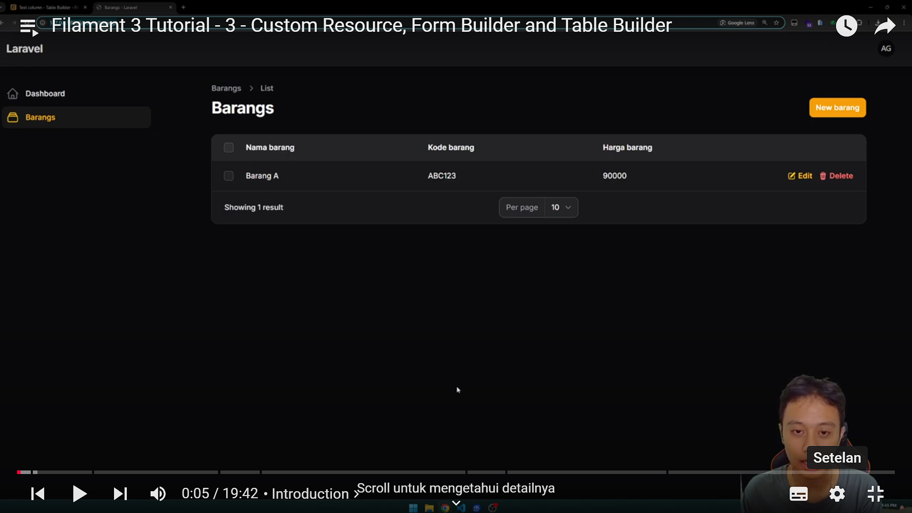
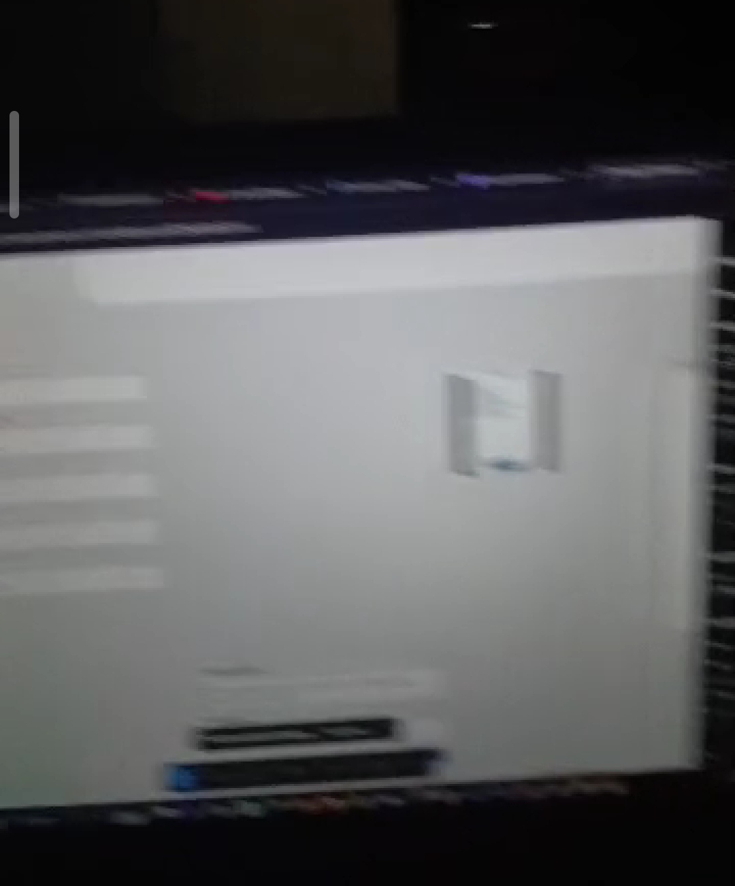

<h1><strong>Di Hari Kedua, 02 Januari 2025, Aku Belajar Tentang Laravel Filament Hari Ini.
</strong></h1>

Hari ini, aku lanjut mengerjakan tugas dari request kakak kelas, yaitu membuat aplikasi laundry dengan membuat tampilan user di Flutter dan tampilan admin di Laravel.

Nah Aku dapet ide tadi siang untuk memakai Laravel Filament karena memudahkan saat membuat tampilan admin tanpa kita harus tau secara dalam bagaimana proses CRUD (Create, Read, Update, Delete) terjadi di sisi BackEnd.

Karena Aku masih belum paham cara pakai Laravel Filament, carilah aku ke Youtube, disana aku nemuin satu playlist yang menurutku mudah dipahami, kalo temen - temen minat bisa lihat di link <a href="https://www.youtube.com/playlist?list=PLyqDBCxAsB_Tan60LTYv9rHKIlggEzQIk">berikut</a>.

Di channel Pak Ari Gunawan Jatmiko, aku jadi tau secara garis besar gimana cara pakai Laravel Filament, diantaranya :

1. Form Builder untuk tampilan Create & Update Data setiap Model
2. Table Builder untuk tampilan dashboard
3. Responsive Form Builder untuk mengatur agar Form responsive
4. Lifecycle Hook agar kolom form tertentu bisa terisi otomatis saat kolom lain selesai diisi
5. Serta, custom Notifications

Menurutku udah lumayan banyak materi yang kudapat setelah menamatkan playlist ini seharian, tetapi memang masih belum hapal sih, masih wajib di praktekkin lagi.

Overall progress pengerjaan tugas hari ini cukup lancar, tetapi masih belum selesai, yosh besok harus diselesaikan 🔥🔥.

Oh iya, btw tadi ngerjain di kampus sampe jam 10 Malem, Itu aja sampe lampu mati awokwwkk

<h1>Itu dulu sih cerita hari ini, ketemu lagi besok ♥♥</h1>

<h1>Lampiran - Lampiran :</h1>
<figure>
  
  <figcaption>Foto Salah Satu Video Laravel Filament, Worth It Guys</figcaption>
</figure>

<figure>
  
  <figcaption>STIMATA Mati Lampu Jam 22:30 Guys 🤣🤣</figcaption>
</figure>