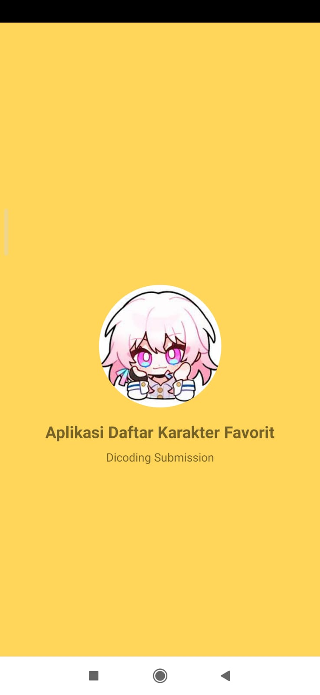
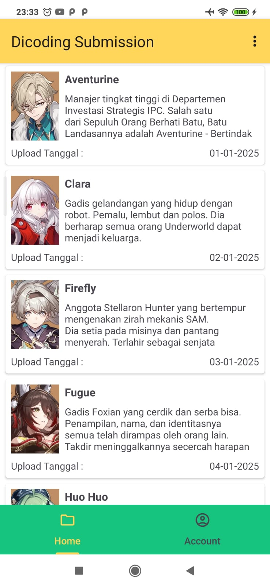
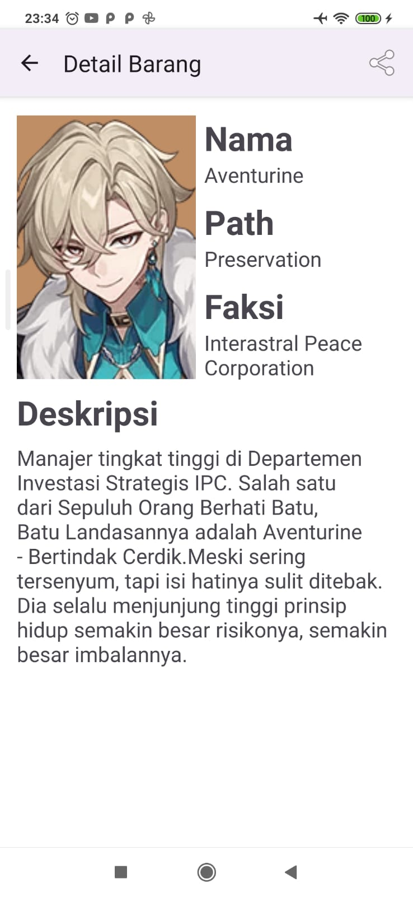

# The Fundamental Of Kotlin, I Know Today !!
Hari ini aku belajar banyak setelah menyelesaikan Task Pertama Dicoding
di kelas belajar membuat aplikasi android pemula. Disini aku berhasil membuat 
aplikasi android untuk menampilkan daftar karakter Honkai Star Rail favoritku 🌟🌟

Disini aku juga melek banget tentang Kotlin nya, alhamdulillah setelah satu semester
aku jadi bisa tau alur dasar gimana sih cara bikin aplikasi pakai kotlin itu.
Nah disini aku jadi tau fungsi adapter dan recyclerview, yaitu untuk keperluan dalam
menampilkan banyak data didalam tampilan aplikasi. Ternyata secara basic, sangat mudah
dipahami kalau kita memang niat belajar.

Untuk temen - temen yang penasaran lihat hasil aplikasi nya, check this out ✨✨
<figure>
  
  <figcaption>Soo Cute, Isn't It ? March 7th Icon 😍😍</figcaption>
</figure>
<figure>
  
  <figcaption>Tampilan Recycler View Dengan Gaya Linear Layout, Mantap Bukan ?</figcaption>
</figure>
<figure>
  
  <figcaption>Ambaturin The Best Shielder In The Game Came In Detail Screen ✨✨</figcaption>
</figure>
