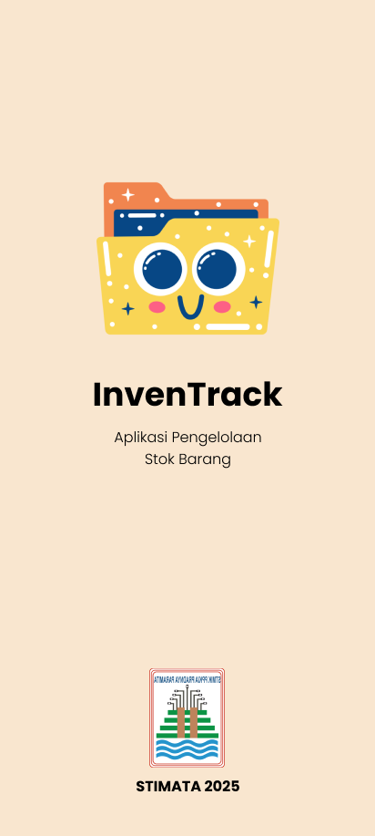

# Hari Selasa Recap ✨✨
Hari ini engga banyak yang bisa diceritakan sih
Hari ini aku belajar Figma lagi setelah mungkin 6 bulan lebih
belum nyentuh Figma lagi, untuk keperluan tugas Akhir projek
Mata Kuliah Analasis Perancangan Sistem Informasi

Di tugas akhir kali ini, aku membuat sebuah rancangan UI
untuk memudahkan Koperasi Sekolah dalam memanajemen arus
transaksi keuangan, mulai dari hitung barang keluar masuk harian
dan juga menghitung penghasilan yang nanti direkap per bulannya

Progress masih belum sepenuhnya selesai, tapi gambaran besarnya udah nangkep sih,
jadi besok pagi mau dilanjutin lagi, bismillah bisa istiqomah 💖

# Check The Progress ✨✨
<figure>
  
  <figcaption>Soo Cute, Isn't It ?</figcaption>
</figure>

<figure>
  
  <figcaption>Kurang Lebih Nanti Ada Menu Input Barang, History Transaksi, & Add Transaksi, Lebih Lengkapnya Stay Tune Yaa 😍😍</figcaption>
</figure>

---- That's All For Today ----