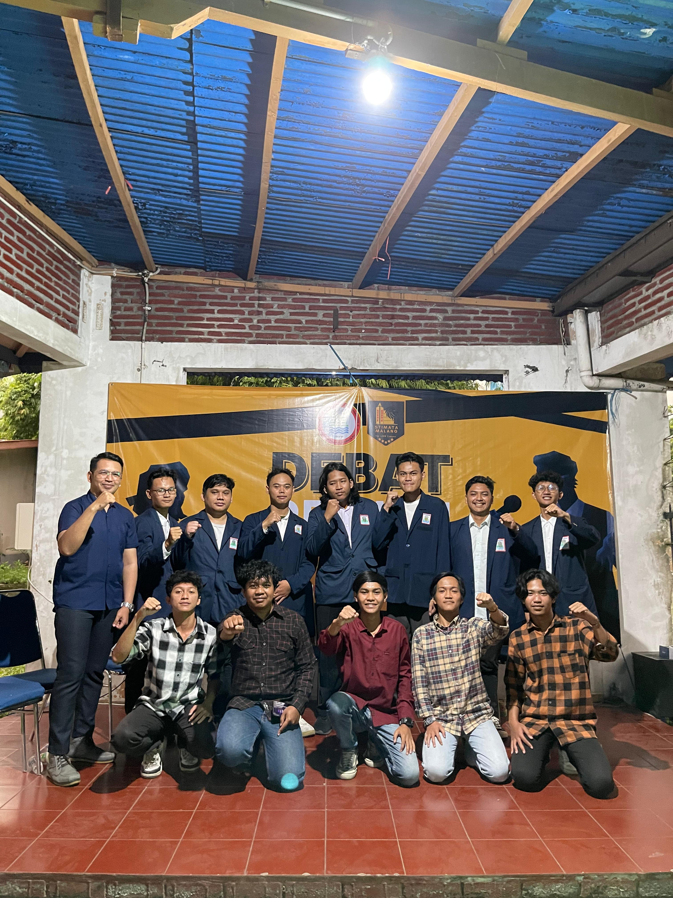

Hari ini tidak banyak yang bisa diceritakan sih, mungkin hanya pikiran yang agak lelah karena masih banyaknya tugas akhir yang menumpuk sebelum UAS di minggu depan.

Hari ini diakhiri dengan debat calon Presiden Mahasiswa yang lumayan lancar, aku sebagai salah satu kandidat sudah berusaha dengan maksimal dalam menyampaikan visi dan misi.

Dan juga hari ini belajar banyak tentang teori livedata dan android ktx pada kotlin yang jujur masih belum paham sih, jadi memang masih perlu banyak sekali eksplor, karena suatu hal perlu dicoba berkali kali baru bisa mendapatkan esensinya.

--- Thank You For Today, See You Next Day 💖💖 ---
<figure>
  
  <figcaption>Potret Suasana Setelah Debat Calon Presiden Mahasiswa 2025 / 2026 STIMATA Malang</figcaption>
</figure>